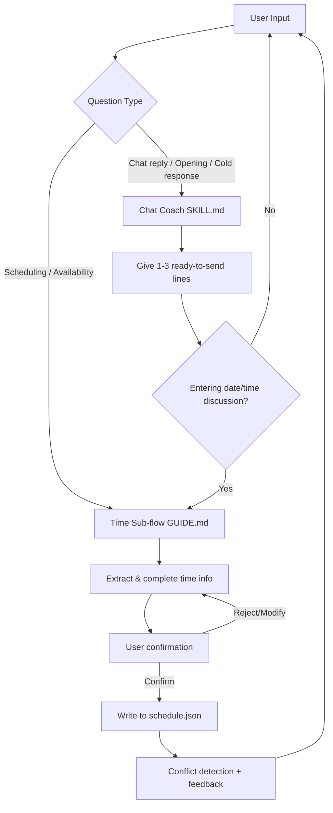

🌐 **English** | [中文](README.md) | [한국어](README.ko.md)

---

# Time Management Master

A unified skill with "chat coaching" as the main entry point and "time management" as an embedded sub-workflow.

The trigger is always a chat scenario: how to reply, how to open, how to ask someone out. When the conversation reaches the "let's meet" stage, time management kicks in automatically — checking availability, filling in times, recording schedules, and detecting conflicts.

> First, the protagonist learns how to talk.  
> Then, how to organize life around it.  
> The first creates the spark; the second makes it real.

---

## 1. Project Structure

```text
Time_Management_Master/
├─ SKILL.md                  ← Main entry (chat coach + time management routing)
├─ README.md
├─ references/
│  ├─ case-library.md       ← Conversation example library
│  └─ psychology-notes.md   ← Psychological mechanism notes
└─ time-manager/
   ├─ GUIDE.md              ← Time management workflow details
   ├─ data/schedule.json    ← Schedule data storage
   └─ scripts/time_manager.py ← CLI script
```

Key design decisions:

- `SKILL.md` is the single entry point; its YAML `description` covers both chat and time scenarios
- Chat scenarios are handled directly in the main file
- Time scenarios are routed via `SKILL.md` to `time-manager/GUIDE.md` and the script

---

## 2. What This Skill Does

## 2.1 Chat Coach (Main Flow): Push Relationships Toward "Let's Meet"

### Role

- Practical, no-nonsense social chat coach
- Output is direct, short, copy-paste ready
- Priority: "What should I say next?"

### Trigger Signals

Activated when the user needs:

- How to open a conversation
- What to do when they go cold
- How to ask someone out
- How to reply to a specific message
- Diagnosis of a message the user wrote

### Core Method

Not dating philosophy — three enforced strategies:

1. **Remove neediness** (don't chase, don't over-explain, don't double-text)
2. **Project selectiveness** (you're evaluating whether they're worth your time)
3. **Create emotion** (light challenge, suspense, push-pull — not just exchanging info)

### Output Style

- 1–3 lines ready to send
- 1–2 sentence explanation
- Call out user mistakes when necessary

Deliberately avoids giving too many options to reduce decision paralysis.

---

## 2.2 Time Manager (Sub-flow): Turn Verbal Plans Into Managed Schedules

> See `time-manager/GUIDE.md` for details

### Role

- The protagonist's time secretary, called internally by the chat coach
- No abstract productivity theory
- Only: record, query, conflict alerts, recommendations, analysis

### Trigger Signals

Activated when the conversation involves time + activity:

- "Am I free this week?"
- "Help me arrange a time"
- "We agreed on Saturday night"
- "Record this appointment"

### Core Capabilities

- New schedule entry (requires user confirmation)
- Free slot query
- Meeting time recommendations (evening-first priority)
- Weekly time analysis
- Schedule deletion (soft delete, marked as cancelled)

### Script Design (Agent-Friendly)

- `--json` flag for machine-readable output
- Exit codes: 0 = success, 1 = business error, 2 = argument error
- stdout for normal output, stderr for errors only

---

## 3. Internal Collaboration

Chat coaching and time management aren't parallel — they're main flow and sub-flow.

When the chat reaches "date confirmed / discussing specifics / agreement formed," `SKILL.md` routes to `time-manager/GUIDE.md`. The handoff data format:

```yaml
SCHEDULE_REQUEST:
  person: Their name
  approximate_time: Time the user mentioned
  location: Place
  task: Activity
```

The time sub-flow takes over: confirms details, fills in precise times, writes to storage, then returns to the chat coach perspective.

This evolves the system from "can talk" to "can remember."

---

## 4. Interaction Routes (Story Mode)

Three recommended interaction routes.

## Route A: From One Reply to One Date

Starting point: You're staring at the chat box, stuck on what to say next.

1. You paste the conversation to the skill
2. The chat coach gives you 1–3 high-execution lines
3. They respond positively, start talking about meeting
4. Time sub-flow activates automatically, checks availability, suggests specific slots
5. You send a date invitation with a concrete time
6. They confirm → time sub-flow records and stores

Result: Conversation goes from emotional momentum to real-world plans.

## Route B: Check Schedule First, Then Craft the Invite

Starting point: You know you want to ask, but you're not sure when you're actually free.

1. Use the time sub-flow to check availability and get recommendations
2. Get 2–3 specific time windows
3. The chat coach automatically embeds the times into invitation lines
4. Send a "naturally extended" invitation

Result: The lines feel like real life, not templates.

## Route C: Review the Week, Optimize the Next Round

Starting point: You feel busy but can't say where the time went.

1. Use the time sub-flow for weekly analysis
2. See who got your time and for what
3. Return to the chat coach, adjust social pacing

Result: Next week is designed, not reactive.

---

## 5. Collaboration Flowchart



---

## 6. Key Command Examples

Using `time-manager/scripts/time_manager.py`:

```bash
# Add a new schedule (most agent-friendly)
python3 time_manager.py add-json '{"start":"2026-04-05 19:00","end":"2026-04-05 21:00","task":"Coffee date","person":"Xiaoyu","location":"Sanlitun"}'

# Check free slots
python3 time_manager.py free --json

# Suggest meeting times
python3 time_manager.py suggest --person Xiaoyu --duration 120 --json

# Weekly analysis
python3 time_manager.py analyze
```

---

## 7. Why This Design Works

Most chat systems stop at "can talk." Most calendar systems stop at "can record."

This skill's value:

- The chat coach creates social opportunities
- The time sub-flow locks them down

In one sentence:

> It's not a chat template library — it's a closed loop from conversation to action.

---

## 8. Future Extensions

1. Add a `post-date-review` module: auto-review after dates with next-step strategy
2. Add a "reminder window" command to time-manager (e.g., alert 3 hours before)
3. Add a "relationship stage detector" to the chat coach (stranger / warming up / confirmed)
