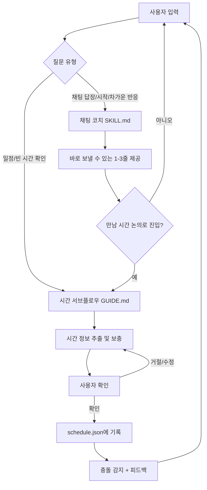

🌐 [English](README.en.md) | [中文](README.md) | **한국어**

---

# Time Management Master

"채팅 코칭"을 메인 입구로, "시간 관리"를 내장 서브 워크플로우로 결합한 통합 skill입니다.

사용자의 트리거는 항상 채팅입니다: 어떻게 답장할지, 어떻게 시작할지, 어떻게 만남을 잡을지. 대화가 "만나자" 단계에 도달하면, 시간 관리가 내부 서브 플로우로 자동 개입합니다 — 빈 시간 확인, 시간 보충, 일정 기록, 충돌 감지.

> 주인공은 먼저 대화하는 법을 배우고, 그다음 생활을 정리하는 법을 배웁니다.  
> 전자는 불꽃을 담당하고, 후자는 실현을 담당합니다.

---

## 1. 프로젝트 구조

```text
Time_Management_Master/
├─ SKILL.md                  ← 메인 입구 (채팅 코치 + 시간 관리 라우팅)
├─ README.md
├─ references/
│  ├─ case-library.md       ← 대화 사례 라이브러리
│  └─ psychology-notes.md   ← 심리 메커니즘 노트
└─ time-manager/
   ├─ GUIDE.md              ← 시간 관리 워크플로우 상세
   ├─ data/schedule.json    ← 일정 데이터 저장소
   └─ scripts/time_manager.py ← CLI 스크립트
```

핵심 설계:

- `SKILL.md`가 유일한 입구이며, YAML `description`이 채팅과 시간 두 시나리오를 모두 커버
- 채팅 시나리오는 메인 파일에서 직접 처리
- 시간 시나리오는 SKILL.md의 안내를 통해 `time-manager/GUIDE.md`와 스크립트로 이동

---

## 2. 이 Skill이 하는 일

## 2.1 채팅 코치 (메인 플로우): 관계를 "만남"까지 밀어붙이기

### 역할

- 실전형 소셜 채팅 코치
- 직접적이고 짧은 문장, 복사해서 바로 보낼 수 있는 출력
- 우선순위: "다음에 뭐라고 보내지?"

### 트리거 신호

다음 상황에서 즉시 활성화:

- 어떻게 시작하지
- 상대방이 차가워졌을 때 어떻게 하지
- 어떻게 만남을 잡지
- 이 메시지에 뭐라고 답하지
- 사용자가 자신이 쓴 메시지를 진단해달라고 할 때

### 핵심 방법

연애 철학이 아닌, 세 가지 강제 전략:

1. **니즈감 제거** (추궁하지 않기, 과도한 설명 금지, 연속 메시지 금지)
2. **선별감 투사** (상대방이 내 시간을 투자할 가치가 있는지 평가하는 프레임)
3. **감정 만들기** (가벼운 도전, 여백, 밀당 — 단순한 정보 교환이 아닌)

### 출력 스타일

- 바로 보낼 수 있는 1~3줄
- 1~2문장 간결한 설명
- 필요시 사용자의 실수 지적

선택지를 너무 많이 주지 않아 실행 저항을 줄임.

---

## 2.2 시간 관리 (서브 플로우): 구두 약속을 관리 가능한 일정으로

> 자세한 내용은 `time-manager/GUIDE.md` 참조

### 역할

- 주인공의 시간 비서, 채팅 코치의 내부 모듈로 호출됨
- 추상적인 생산성 이론 없음
- 오직: 기록, 조회, 충돌 알림, 추천, 분석

### 트리거 신호

대화에 시간 + 활동 조합이 나타날 때 활성화:

- 이번 주 언제 비어?
- 시간 좀 잡아줘
- 토요일 저녁에 약속했어
- 이 약속 기록해줘

### 핵심 기능

- 새 일정 기록 (사용자 확인 필수)
- 빈 시간대 조회
- 만남 시간 추천 (저녁 시간대 우선)
- 주간 시간 분석
- 일정 삭제 (소프트 삭제, cancelled 표시)

### 스크립트 특징 (Agent 친화적)

- `--json` 플래그로 기계 판독 가능한 출력
- 종료 코드: 0=성공, 1=비즈니스 오류, 2=인자 오류
- 정상 출력은 stdout, 오류는 stderr로 분리

---

## 3. 내부 협업 메커니즘

채팅 코칭과 시간 관리는 병렬이 아닌, 메인 플로우와 서브 플로우의 관계입니다.

채팅이 "약속 확정 / 구체적 시간 논의 / 합의 형성" 단계에 도달하면, SKILL.md가 `time-manager/GUIDE.md`로 라우팅합니다. 핸드오프 데이터 형식:

```yaml
SCHEDULE_REQUEST:
  person: 상대방 이름
  approximate_time: 사용자가 언급한 시간
  location: 장소
  task: 활동
```

시간 서브 플로우가 인계받아 세부사항을 확인하고, 정확한 시간을 채우고, 저장소에 기록한 후 채팅 코치 시점으로 돌아옵니다.

이것이 시스템을 "말할 수 있는"에서 "기억할 수 있는"으로 진화시킵니다.

---

## 4. 인터랙션 루트 (스토리 모드)

추천하는 세 가지 인터랙션 루트입니다.

## 루트 A: 한 번의 답장에서 한 번의 만남으로

시작점: 채팅창을 바라보며, 다음에 뭐라고 할지 모르겠다.

1. 대화를 skill에 붙여넣기
2. 채팅 코치가 1~3개의 고실행력 멘트 제공
3. 상대방이 긍정적으로 반응, 만남 이야기 시작
4. 시간 서브 플로우가 자동으로 활성화, 빈 시간 확인 후 구체적 시간대 제안
5. 구체적 시간이 들어간 만남 제안 발송
6. 상대방 확인 후 → 시간 서브 플로우가 기록 및 저장

결과: 감정적 추진력에서 현실적 계획으로.

## 루트 B: 일정 먼저 확인, 그 다음 초대 멘트 작성

시작점: 약속을 잡고 싶은데, 언제 진짜 비는지 모르겠다.

1. 시간 서브 플로우로 빈 시간 확인 및 추천 받기
2. 2~3개의 구체적 시간 윈도우 획득
3. 채팅 코치가 자동으로 시간을 초대 문장에 삽입
4. "자연스럽게 확장된" 초대 발송

결과: 멘트가 템플릿이 아닌 실제 생활처럼 느껴짐.

## 루트 C: 한 주 복기, 다음 라운드 최적화

시작점: 바쁜 것 같은데 뭐에 바빴는지 모르겠다.

1. 시간 서브 플로우로 주간 분석
2. 시간이 누구에게, 무엇에 쓰였는지 확인
3. 채팅 코치로 돌아가 소셜 추진 리듬 조정

결과: 다음 주는 반응적이 아닌, 설계된 한 주.

---

## 5. 협업 플로우차트



---

## 6. 주요 명령어 예시

`time-manager/scripts/time_manager.py` 사용 예:

```bash
# 새 일정 추가 (에이전트 호출에 최적)
python3 time_manager.py add-json '{"start":"2026-04-05 19:00","end":"2026-04-05 21:00","task":"커피 만남","person":"소우","location":"산리툰"}'

# 빈 시간 확인
python3 time_manager.py free --json

# 만남 시간 추천
python3 time_manager.py suggest --person 소우 --duration 120 --json

# 주간 분석
python3 time_manager.py analyze
```

---

## 7. 이 설계가 효과적인 이유

대부분의 채팅 시스템은 "말할 수 있다"에서 멈추고, 대부분의 캘린더 시스템은 "기록할 수 있다"에서 멈춥니다.

이 skill의 가치:

- 채팅 코치가 소셜 기회를 만들어냄
- 시간 서브 플로우가 그 기회를 확정시킴

한 마디로:

> 채팅 템플릿 저장소가 아니라, 대화에서 행동까지의 클로즈드 루프입니다.

---

## 8. 향후 확장 방향

1. `post-date-review` 모듈 추가: 만남 후 자동 복기 및 다음 단계 전략 제공
2. time-manager에 "리마인더 윈도우" 명령 추가 (예: 3시간 전 알림)
3. 채팅 코치에 "관계 단계 감지기" 추가 (낯선 사이 / 워밍업 / 확정)
