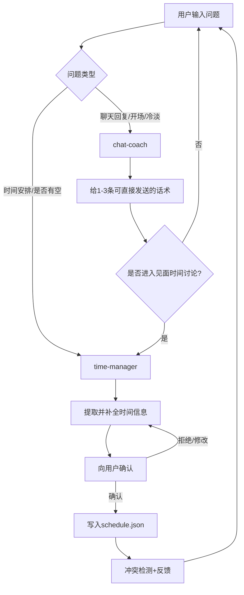

# Time Management Master: 双 Skill 协作手册

这是一个围绕“聊天推进 + 时间落地”设计的双 skill 组合：

- `chat-coach.skill` 负责把对话从尬聊推进到可执行邀约
- `time-manager.skill` 负责把口头约定变成可查询、可分析、可冲突检查的日程

你可以把它理解为一个连续剧情：

> 主角先学会怎么说对话，再学会怎么安排生活。  
> 前者负责火花，后者负责落地。

---

## 1. 项目结构

当前仓库包含原始 `.skill` 打包文件，以及解包后的可读内容：

```text
Time_ManagementMaster/
├─ chat-coach.skill
├─ time-manager.skill
├─ README.md
├─ chat-coach_extracted/
│  └─ chat-coach/
│     ├─ SKILL.md
│     └─ references/
│        ├─ case-library.md
│        └─ psychology-notes.md
└─ time-manager_extracted/
   └─ time-manager/
      ├─ SKILL.md
      ├─ data/
      │  └─ schedule.json
      └─ scripts/
         └─ time_manager.py
```

其中：

- `chat-coach_extracted/chat-coach/SKILL.md` 是聊天教练主逻辑
- `chat-coach_extracted/chat-coach/references/` 是话术案例和心理机制解释
- `time-manager_extracted/time-manager/SKILL.md` 是时间秘书主逻辑
- `time-manager_extracted/time-manager/scripts/time_manager.py` 是可执行 CLI
- `time-manager_extracted/time-manager/data/schedule.json` 是日程存储

---

## 2. 两个 Skill 在做什么

## 2.1 chat-coach: 把关系推进到“可见面”

### 角色定位

- 实战型聊天教练
- 输出偏直接、短句、可复制发送
- 优先解决“下一句发什么”

### 触发信号

当用户出现以下需求时立刻触发：

- 怎么开场
- 对方冷淡怎么办
- 怎么约出来
- 这句话怎么回
- 用户贴了一段对话让你改

### 核心方法

它不是给你“恋爱大道理”，而是强制执行三条底层策略：

1. 去需求感（不追问、不解释、不连发）
2. 有筛选感（你在判断对方是否值得投入）
3. 制造情绪（轻挑战、留白、推拉，而不只是信息交换）

### 输出风格

- 1 到 3 条可直接发的话
- 1 到 2 句简短解释
- 必要时点名用户错误动作

它故意避免“给太多选项”，降低用户执行阻力。

---

## 2.2 time-manager: 把口头邀约变成可管理日程

### 角色定位

- 主角的时间秘书
- 不讲抽象效率学
- 只做记录、查询、冲突提醒、推荐、分析

### 触发信号

当对话出现时间和活动组合时触发：

- 我这周有空吗
- 帮我安排时间
- 我们约了周六晚上
- 记录一下这个安排

### 核心能力

- 新日程写入（必须先确认）
- 空闲时段查询
- 未来可约时间推荐（偏傍晚优先）
- 周度时间分析
- 日程删除（软删除，标记 cancelled）

### 脚本特征（适合 agent 调用）

- 支持 `--json` 机器可读输出
- 约定了退出码：0 成功，1 业务错误，2 参数错误
- 正常输出和错误输出分离（stdout/stderr）

---

## 3. 双 Skill 的协作协议

它们不是并列关系，而是接力关系。

chat-coach 在“邀约成功/讨论具体时间/已形成约定”时，把信息移交给 time-manager，数据包格式为：

```yaml
SCHEDULE_REQUEST:
  person: 对方名字
  approximate_time: 用户提到的时间
  location: 地点
  task: 活动
```

time-manager 接手后进入确认流程，补齐时间精度，再写入日程。

这让系统从“会说”进化为“会记”。

---

## 4. 互动路线（故事版）

下面是最推荐的三条互动路线。

## 路线 A: 从一句回复，到一次见面

故事起点：你盯着聊天框，不知道下一句怎么回。

1. 你把对话贴给 chat-coach
2. chat-coach 给你 1 到 3 条高执行话术
3. 对方反应变积极，开始谈见面
4. chat-coach 调用 time-manager 查空档并给具体时段
5. 你发出“带具体时间”的邀约
6. 对方确认后，time-manager 二次确认并落库

结果：对话从情绪推进，进入现实安排。

## 路线 B: 先看日程，再反推话术

故事起点：你知道要约，但你不确定自己哪天真的有空。

1. 先用 time-manager 查空闲和推荐时间
2. 拿到 2 到 3 个具体时间窗口
3. 交给 chat-coach，把时间嵌入邀约句子
4. 发出“自然延伸型邀约”

结果：话术更像真实生活，而不是模板句。

## 路线 C: 复盘一周，优化下一轮

故事起点：你感觉自己很忙，但说不清忙在哪。

1. 用 time-manager 做周分析
2. 看时间都给了谁、给了什么事
3. 回到 chat-coach，调整社交推进节奏

结果：下一周不再被动补救，而是主动设计互动。

---

## 5. 协作流程图



---

## 6. 关键命令示例

以 `time-manager_extracted/time-manager/scripts/time_manager.py` 为例：

```bash
# 新增日程（程序调用最友好）
python3 time_manager.py add-json '{"start":"2026-04-05 19:00","end":"2026-04-05 21:00","task":"见面喝咖啡","person":"小雨","location":"三里屯"}'

# 查空闲
python3 time_manager.py free --json

# 推荐见面时间
python3 time_manager.py suggest --person 小雨 --duration 120 --json

# 本周分析
python3 time_manager.py analyze
```

---

## 7. 为什么这套设计有效

常见聊天系统停在“会说”；常见日历系统停在“会记”。

这两个 skill 的价值在于：

- chat-coach 负责把社交机会创造出来
- time-manager 负责把社交机会固定下来

一句话总结：

> 它不是一个聊天模板仓库，而是一条从聊天到行动的闭环路线。

---

## 8. 推送到 GitHub 的最短流程

如果你已创建好远程仓库，直接在当前目录执行：

```bash
git init
git add .
git commit -m "feat: add chat-coach and time-manager skills with story-driven README"
git branch -M main
git remote add origin <你的仓库地址>
git push -u origin main
```

如果你已经初始化过仓库，只需要从 `git add .` 开始。

---

## 9. 后续可扩展方向

1. 增加 `post-date-review` skill：约会后自动复盘并给下一步策略
2. 给 time-manager 增加“提醒窗口”命令（例如提前 3 小时提醒）
3. 给 chat-coach 增加“关系阶段识别器”（陌生期/升温期/确认期）
